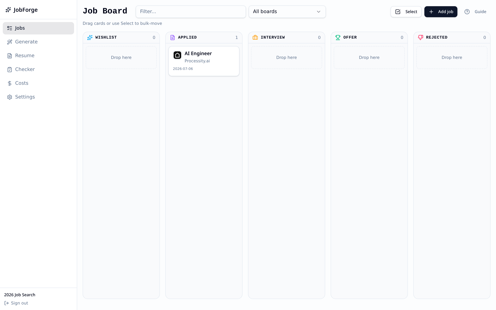
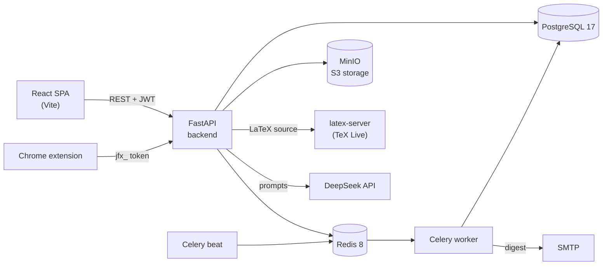

<div align="center">


# JobForge

**A self-hosted, AI-assisted command center for your job search.**
Track every application, tailor a LaTeX resume and cover letter to each job description, and get real PDFs. You own your data.

[](LICENSE)


</div>

<p align="center">
  
</p>

## Why JobForge?

Job hunting is a pipeline problem: dozens of postings, a different resume for each, and replies you can lose track of. JobForge keeps all of it in one place:

- **Save** jobs from any site with a Chrome extension (duplicates are detected for you).
- **Tailor** your resume and cover letter to each job with AI, then **compile real PDFs** from LaTeX.
- **Track** every application on a board and see what happened, when.
- **Stay on top of it** with a twice-daily digest email and follow-up reminders.
- **Self-host it.** One `docker compose up`, your own database, your own API keys.

## Features

| Area | What you get |
|---|---|
| **Job board** | Kanban board (Wishlist → Applied → Interview → Offer → Rejected), drag and drop, bulk move, search, multiple boards, Excel export |
| **Job detail** | JD keyword insights, fit score against your resume, notes, every generated document in one place, company logo and info |
| **Tailoring** | Paste a JD and get a tailored resume plus cover letter in one pass; ATS score and keyword gaps after every run |
| **AI tools** | Cover letter, follow-ups, interview prep, thank-you notes, reschedule/decline, offer negotiation and more (23 YAML prompt templates) |
| **Resume editor** | LaTeX editor with live server-compiled PDF preview, colour pickers, version history, PDF-to-LaTeX import |
| **Chrome extension** | Save a job from any posting, autofill application forms from your profile |
| **Tracking engine** | One place where every status change is recorded (timestamps, follow-up dates, audit trail); URL-based duplicate detection; overview metrics API |
| **Digest** | Optional 7 AM / 6 PM (IST) summary email with one-click unsubscribe |
| **Cost ledger** | Every AI call logs tokens, cost, model and purpose per workspace |

> The backend already exposes richer tracking (eight statuses, per-board reply rates, follow-ups, `/api/v1/overview/*`); the web UI for it is being rebuilt. See [Roadmap](#roadmap).

## Architecture



| Layer | Stack |
|---|---|
| Frontend | React 19, Vite, React Router 7, TanStack Query, Tailwind CSS 4, shadcn/ui, dnd-kit |
| Backend | FastAPI, SQLAlchemy 2 (async), Pydantic v2, Alembic |
| Data | PostgreSQL 17, Redis 8, MinIO |
| Background | Celery + Celery Beat |
| PDFs | Self-hosted TeX Live compile service (`latex-server/`) |
| AI | DeepSeek API (any OpenAI-compatible endpoint can be configured) |
| Auth | Google OAuth 2.0 sign-in, JWT access + refresh tokens |

## Quick start

**You need:** Docker 24+ with Compose v2, about 4 GB of RAM (TeX Live is large), and:

1. A **DeepSeek API key** ([platform.deepseek.com](https://platform.deepseek.com)) for the AI features.
2. A **Google OAuth client** ([console.cloud.google.com](https://console.cloud.google.com) → APIs & Services → Credentials → OAuth client ID, type *Web application*). Add `http://localhost:5454/api/v1/auth/google/callback` as an authorised redirect URI. Sign-in is Google-only.

```bash
git clone https://github.com/KunalScriptz/jobforgex.git
cd jobforgex

cp .env.example .env
# Edit .env: set DEEPSEEK_API_KEY, GOOGLE_CLIENT_ID, GOOGLE_CLIENT_SECRET,
# and replace every "change-me" secret (see "Configuration" below).

docker compose up -d --build
```

Then open **http://localhost:5173** and sign in with Google. The database schema is created automatically on first start.

| Service | URL / port |
|---|---|
| Web app | http://localhost:5173 |
| API + docs | http://localhost:5454 and http://localhost:5454/docs |
| PostgreSQL | `localhost:5433` |
| Redis | `localhost:6380` |
| MinIO API / console | `localhost:9002` / http://localhost:9003 |
| pgAdmin | http://localhost:5051 |
| LaTeX compiler | `localhost:5959` |

> **Before exposing this to the internet:** change every default password and secret in `.env`, set `ENVIRONMENT=production`, restrict `CORS_ORIGINS` to your own domain, and put the app behind HTTPS (an example nginx config is in [`infrastructure/nginx/`](infrastructure/nginx/)).

## Configuration

Everything is configured through environment variables; [`.env.example`](.env.example) documents all of them. The ones you will touch first:

| Variable | Purpose |
|---|---|
| `DEEPSEEK_API_KEY` | Required for all AI features |
| `GOOGLE_CLIENT_ID`, `GOOGLE_CLIENT_SECRET`, `GOOGLE_REDIRECT_URI` | Required to sign in |
| `JWT_SECRET`, `DEEPSEEK_KEY_ENC_SECRET` | Long random strings (`openssl rand -hex 32`) |
| `DB_PASSWORD`, `MINIO_SECRET_KEY`, `PGADMIN_PASSWORD` | Change from the defaults |
| `SMTP_*` | Only needed for emails (welcome, password reset, digest) |
| `DIGEST_ENABLED` | `true` to send the twice-daily digest (off by default) |
| `CORS_ORIGINS`, `VITE_API_URL` | Set both when serving from your own domain |
| `FEATURE_PIPELINE`, `FEATURE_GMAIL` | Feature flags for upcoming areas; leave `false` |

## Project structure

```text
backend/            FastAPI app
  app/routers/        HTTP routes (every non-public route is authenticated and workspace-scoped)
  app/services/       Business logic (job_state.py is the only place a job's status changes)
  app/models/         SQLAlchemy models
  app/tasks/          Celery tasks (digest email)
  alembic/            Database migrations (the schema owner)
  config/prompts/     YAML prompt templates for the AI features
  tests/              pytest suite
frontend/           React SPA (src/pages, src/components, src/api, src/hooks, src/lib)
extension/          Chrome extension (Manifest V3)
latex-server/       Express + pdflatex compile service
infrastructure/     nginx and pgAdmin config examples
docs/               Architecture, API, deployment and local-development guides
```

## Development

```bash
docker compose up -d                       # everything, with hot reload for frontend and backend
docker compose up -d postgres redis minio latex-server   # just the dependencies
```

**Backend tests**

```bash
cd backend
uv sync                                     # installs dependencies into .venv (https://docs.astral.sh/uv/)
uv run pytest -q                                   # unit tests, no database needed
TEST_DATABASE_URL_SYNC=postgresql+psycopg2://user:pw@localhost:5433/jobforgex_test uv run pytest -q
                                            # also runs the database-backed tests; use a scratch database!
```

**Frontend**

```bash
cd frontend && npm install
npm run dev        # Vite dev server
npm run build      # type-check + production build
```

**Database migrations** are hand-written Alembic revisions that only add things (no drops or renames), so a rollback of the code is always safe:

```bash
cd backend
uv run alembic upgrade head
uv run alembic revision -m "add something"
```

More detail: [`docs/local-development.md`](docs/local-development.md), [`docs/architecture.md`](docs/architecture.md), [`docs/api-specification.md`](docs/api-specification.md).

## Chrome extension

1. Open `chrome://extensions`, enable **Developer mode**.
2. Click **Load unpacked** and choose the [`extension/`](extension/) folder.
3. In JobForge go to **Settings → Chrome extension**, create a token (`jfx_…`), and paste it with your API host into the extension popup.
4. On any job posting, open the extension panel and click **Save**.

## Deployment

The repo ships with a GitHub Actions workflow that deploys to a self-hosted runner: it runs the Alembic migrations first (a failed migration aborts the deploy while the old version keeps serving), then rebuilds the containers. The `.env` is written from your repository secrets on each deploy. See [`docs/deployment.md`](docs/deployment.md), and adapt [`.github/workflows/ci.yml`](.github/workflows/ci.yml) to your own server.

> If you fork this and use a self-hosted runner, don't let pull requests from forks run on it. Keep the workflow `push`-only and require approval for outside contributors.

## Roadmap

- [x] Tracking engine: lifecycle timestamps, audit trail, duplicate detection, follow-ups
- [x] Tenant isolation and Alembic-owned schema
- [ ] New UI: grouped sidebar, Overview, Today, Discovery, 7-stage Tracker (API is done)
- [ ] AI pipeline: fit analysis, evidence-only tailoring, AI review, approvals
- [ ] Gmail sync to update application status automatically
- [ ] Job discovery adapters (ATS feeds, job boards)

## Contributing

Contributions are welcome. Please read [CONTRIBUTING.md](CONTRIBUTING.md) first. Security issues: see [SECURITY.md](SECURITY.md); please don't open a public issue.

## License

[MIT](LICENSE) © JobForge contributors
